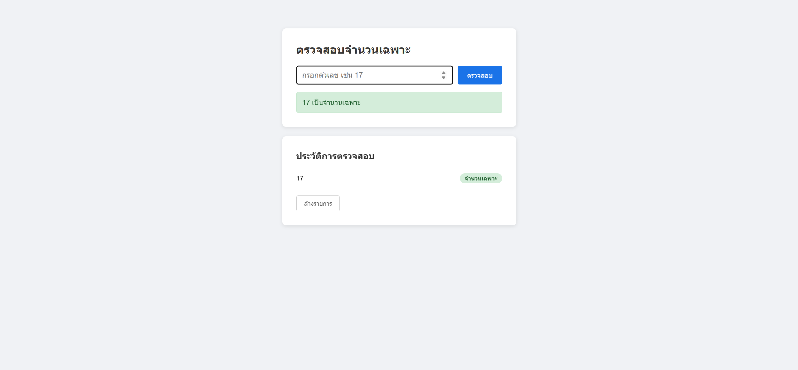
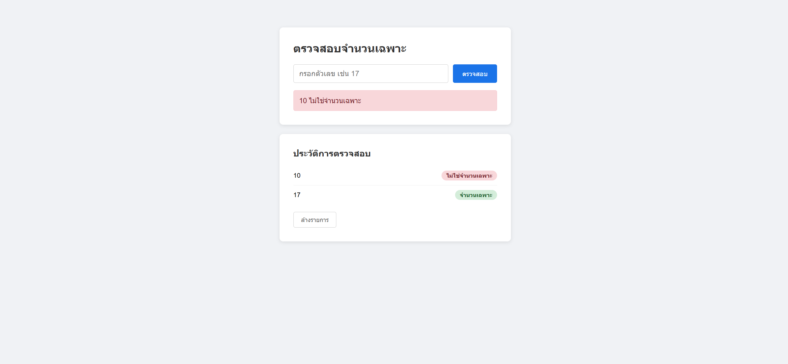

# Prime Number Checker API

โปรเจกต์ตรวจสอบจำนวนเฉพาะ (Prime Number) สำหรับ Celestica Programming Test No.2  
ประกอบด้วย **ASP.NET Core Web API** (Backend) และ **HTML/JavaScript** (Frontend)

## ฟีเจอร์

- กรอกตัวเลขแล้วตรวจสอบว่าเป็นจำนวนเฉพาะหรือไม่
- แสดงผลลัพธ์ทันที (สีเขียว = จำนวนเฉพาะ, สีแดง = ไม่ใช่จำนวนเฉพาะ)
- บันทึกประวัติการตรวจสอบใน `localStorage`
- ล้างประวัติได้จากปุ่ม "ล้างรายการ"

## ภาพหน้าจอ

### ตัวเลขเป็นจำนวนเฉพาะ (17)



### ตัวเลขไม่ใช่จำนวนเฉพาะ (10)



## เทคโนโลยีที่ใช้

| ส่วน | เทคโนโลยี |
|------|-----------|
| Backend | ASP.NET Core (.NET 10) |
| Frontend | HTML, CSS, JavaScript |
| API | REST (JSON) |

## API Endpoint

**POST** `/api/prime/check`

**Request Body**
```json
{
  "number": 17
}
```

**Response**
```json
{
  "number": 17,
  "isPrime": true,
  "message": "17 เป็นจำนวนเฉพาะ"
}
```

## วิธีรันโปรเจกต์

### 1. รัน Backend

```bash
cd PrimeCheckerAPI
dotnet run
```

API จะทำงานที่ `http://localhost:5259`

### 2. เปิด Frontend

เปิดไฟล์ `index.html` ในเบราว์เซอร์ (ดับเบิลคลิก หรือลากไฟล์เข้า Chrome/Edge)

> ต้องรัน Backend ก่อน Frontend ถึงจะเรียก API ได้

## โครงสร้างโปรเจกต์

```
PrimeCheckerAPI/
├── Program.cs          # API และ logic ตรวจสอบจำนวนเฉพาะ
├── index.html          # หน้าเว็บ Frontend
├── docs/               # ภาพหน้าจอ
├── Properties/
└── appsettings.json
```

## ผู้พัฒนา

Phongphisut Khenchat
